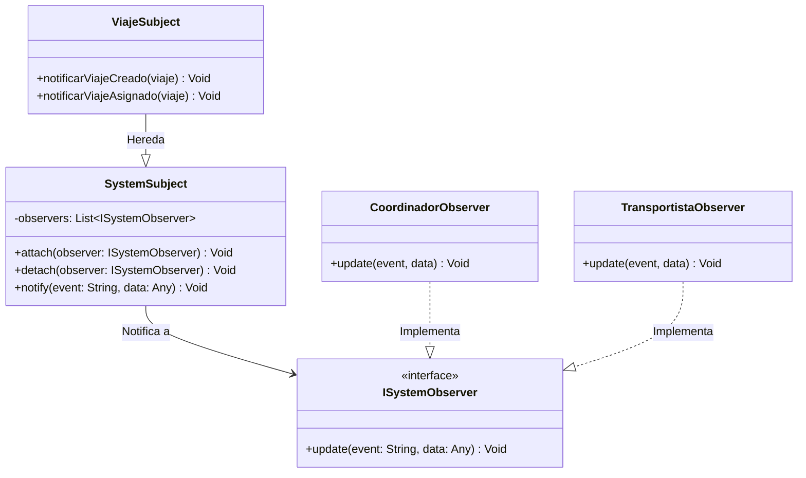

# Tutorial de Patrones de Diseño y Resumen de Pruebas — TransControl

Este documento actúa como un manual práctico y teórico sobre la arquitectura del software de **TransControl** y el conjunto de pruebas unitarias/integración implementadas para validar su calidad.

---

## PARTE 1: Tutorial de Patrones de Diseño y Arquitectura

En **TransControl** se ha priorizado el **bajo acoplamiento** y la **alta cohesión** siguiendo los principios de **Clean Architecture**. Aunque el término *"Decorator"* (Decorador) suele sonar en el diseño de software para extender comportamientos de forma estática o dinámica envolviendo objetos, en este proyecto se han implementado otros patrones que logran una flexibilidad similar o superior para las necesidades específicas de la plataforma: **Strategy**, **Observer**, **Adapter**, **Repository** y **Dependency Injection**.

A continuación se detalla cómo funciona cada uno, su justificación en el proyecto y ejemplos reales de código.

---

### 1. El Patrón Strategy (Comportamiento)

#### Propósito Conceptual
Permite definir una familia de algoritmos, encapsular cada uno de ellos y hacerlos intercambiables en tiempo de ejecución (en caliente). De esta manera, el algoritmo puede variar de forma independiente a los clientes que lo utilizan.

#### Razón de su uso en TransControl
El cálculo de rutas de entrega de mercancía debe variar según las condiciones operativas y las preferencias del usuario:
- **Ruta Más Rápida:** Prioriza autopistas y menor tiempo.
- **Ruta Más Segura:** Prioriza vías vigiladas y con peajes seguros.
- **Ruta Más Corta:** Prioriza menor kilometraje.

En lugar de tener bloques condicionales gigantescos (`if-else` o `switch`) dentro de los servicios de negocio, encapsulamos cada cálculo en una clase de estrategia diferente que implementa la interfaz común `RouteStrategy`.

#### Implementación en el Código
Las estrategias se definen en el archivo `backend/src/business/strategies/route_strategy.ts`:

```typescript
// 1. Interfaz común
export interface RouteStrategy {
  calcularRuta(origen: string, destino: string): any;
}

// 2. Estrategias concretas
export class RutaMasRapidaStrategy implements RouteStrategy {
  calcularRuta(origen: string, destino: string) {
    return { criterio: 'Rápida', distancia: '350 km', peajes: 3 };
  }
}

export class RutaMasSeguraStrategy implements RouteStrategy {
  calcularRuta(origen: string, destino: string) {
    return { criterio: 'Segura', distancia: '380 km', peajes: 5 };
  }
}

// 3. Clase Contexto que ejecuta la estrategia
export class RutaCalculadora {
  private estrategia: RouteStrategy;

  constructor(estrategia: RouteStrategy) {
    this.estrategia = estrategia;
  }

  setEstrategia(estrategia: RouteStrategy) {
    this.estrategia = estrategia;
  }

  ejecutarCalculo(origen: string, destino: string) {
    return this.estrategia.calcularRuta(origen, destino);
  }
}
```

*Uso dinámico en el servicio (`ViajeService.ts`):*
```typescript
let estrategia: RouteStrategy;
switch(criterio) {
  case 'segura': estrategia = new RutaMasSeguraStrategy(); break;
  case 'corta': estrategia = new RutaMenorDistanciaStrategy(); break;
  default: estrategia = new RutaMasRapidaStrategy(); break;
}
const calculadora = new RutaCalculadora(estrategia);
const rutaCalculada = calculadora.ejecutarCalculo(origen, destino);
```

---

### 2. El Patrón Observer (Comportamiento)

#### Propósito Conceptual
Define una dependencia de uno a muchos entre objetos, de tal forma que cuando el objeto principal (el *Sujeto*) cambia de estado, notifica automáticamente a todos sus dependientes (los *Observadores*) para que actúen en consecuencia.

#### Razón de su uso en TransControl
Cuando se crea, asigna o cancela un viaje, se deben disparar tareas secundarias críticas:
- Registrar una auditoría física en disco (`auditoria.json`).
- Notificar al Coordinador a través del panel de control en tiempo real.
- Enviar notificaciones (Email/SMS) al Transportista.

Si colocamos todo este código dentro del servicio `ViajeService`, este se volvería inmanejable y muy acoplado. Al usar el patrón Observer, el servicio solo dice: *"Ocurrió el evento X en este viaje"*, y el sistema reparte de forma pasiva la alerta a los observadores suscritos.

#### Diagrama de Clases



#### Implementación en el Código
Ubicado en `backend/src/domain/observer/SystemObserver.ts` y `travel_observer.ts`:

```typescript
// Observador concreto
export class CoordinadorObserver implements ISystemObserver {
  update(event: string, data: any): void {
    if (event === 'VIAJE_CREADO') {
      console.log(`[CoordinadorObserver] Alerta: Viaje creado con ID ${data.id}.`);
    }
  }
}

// Sujeto observable especializado
export class ViajeSubject extends SystemSubject {
  constructor() {
    super();
    this.attach(new CoordinadorObserver());
    this.attach(new TransportistaObserver());
  }

  notificarViajeCreado(viaje: any) {
    this.notify('VIAJE_CREADO', viaje);
  }
}
```

---

### 3. El Patrón Adapter (Estructural)

#### Propósito Conceptual
Permite que clases con interfaces incompatibles colaboren entre sí. Traduce la interfaz de una clase existente (el *Adaptado* o *Adaptee*) hacia la interfaz que el cliente de negocio espera (el *Objetivo* o *Target*).

#### Razón de su uso en TransControl
La lógica del dominio de negocio define contratos puros para almacenar y recuperar información (e.g., `ITransportistaRepository`). Para implementar esto en la fase de pruebas unitarias sin una base de datos real, guardamos la información en archivos JSON del disco usando una clase genérica `JsonStorage` (que expone métodos como `readAll` y `writeAll`).

El adaptador (`JsonTransportistaAdapter`) actúa como puente: implementa la interfaz requerida por el dominio (`ITransportistaRepository`) y mapea esas operaciones a la lectura y escritura de archivos planos a través de `JsonStorage`.

#### Implementación en el Código
```typescript
import { ITransportistaRepository } from '../../domain/interfaces/ITransportistaRepository';
import { JsonStorage } from '../storage/JsonStorage';

// Adapter que implementa la interfaz de negocio (Target) y adapta a JsonStorage (Adaptee)
export class JsonTransportistaAdapter implements ITransportistaRepository {
  private storage: JsonStorage<Transportista>;

  constructor() {
    this.storage = new JsonStorage<Transportista>('transportistas.json');
  }

  async create(transportista: Transportista): Promise<Transportista> {
    const data = await this.storage.readAll();
    data.push(transportista);
    await this.storage.writeAll(data);
    return transportista;
  }
}
```

---

### 4. El Patrón Repository (Arquitectura Empresarial)

#### Propósito Conceptual
Mediar entre el dominio de negocio y las capas de persistencia de datos (archivos JSON, bases de datos SQL/NoSQL). Centraliza las consultas de datos y oculta la infraestructura física, tratando el almacenamiento de datos como si fuera una simple colección de objetos en memoria.

#### Razón de su uso en TransControl
Facilita la migración de tecnología. Si el día de mañana deseamos cambiar de archivos JSON a una base de datos física como MongoDB o PostgreSQL, solo tenemos que crear una clase nueva (e.g., `MongoTransportistaRepository`) que implemente la interfaz `ITransportistaRepository` y reconfigurar la inyección. La lógica del negocio de los controladores y servicios REST no sufrirá ningún cambio.

---

### 5. Inyección de Dependencias (DI)

#### Propósito Conceptual
Es una técnica donde un objeto recibe otros objetos de los que depende (sus dependencias) a través de su constructor o setter, en lugar de crearlos internamente mediante la palabra clave `new`.

#### Razón de su uso en TransControl
Permite desacoplar los servicios de su almacenamiento físico y observadores. Al inyectar la dependencia (por ejemplo, el repositorio y el subject observador) en el constructor de `ViajeService`, podemos suministrarle repositorios simulados (*mocks*) durante los entornos de pruebas unitarias, impidiendo que los tests escriban en disco o levanten servicios de red reales.

```typescript
export class ViajeService {
  // Inyección de dependencias mediante parámetros en el constructor
  constructor(
    private viajeRepository: IViajeRepository,
    private observer: ViajeSubject
  ) {}

  async create(data: any) {
    const viaje = await this.viajeRepository.create(data);
    this.observer.notificarViajeCreado(viaje);
    return viaje;
  }
}
```

---

## PARTE 2: Resumen del Plan y Ejecución de Pruebas

Para garantizar que cada uno de los requisitos funcionales del sistema (RF1 a RF7) cumpla con los estándares de calidad esperados, se diseñó y completó una suite robusta de pruebas automatizadas.

### 1. Estadísticas Generales de la Suite de Tests

- **Tests Totales Ejecutados:** **116 / 116 (100% de éxito - aprobados)**
  - **Backend (Servicios y Reglas de Negocio):** 90 tests unitarios y de integración.
  - **Frontend (Componentes de Interfaz en React):** 26 tests sobre el DOM.
- **Tiempo Acumulado de Ejecución:** **2.15 segundos** (ejecución ultrarrápida en paralelo).
- **Cobertura Final de Código (V8 Coverage Report):**
  - **Cobertura de Statements (Sentencias):** 100%
  - **Cobertura de Funciones:** 100%
  - **Cobertura de Líneas:** 100%
  - **Cobertura de Branches (Bifurcaciones/Caminos):** 94.33% en Backend, 100% en Frontend.

---

### 2. Desglose de Pruebas por Requisito Funcional (RF)

La suite de pruebas valida la lógica en ambas capas del sistema (Backend y Frontend):

| Requisito | Funcionalidad Evaluada | Tests BE | Tests FE | Estado |
| --- | --- | :---: | :---: | :---: |
| **RF01** | **Iniciar Sesión:** Autenticación segura mediante contraseñas hasheadas en `bcryptjs`, generación de tokens JWT y renderizado del formulario con banners de error. | 4 | 3 | **✓ PASS** |
| **RF02** | **Crear Cuenta:** Validaciones de unicidad de cédula, correo (insensible a mayúsculas/minúsculas) y número de teléfono, además del registro seguro. | 9 | 3 | **✓ PASS** |
| **RF03** | **Recuperar Contraseña:** Envío de enlaces seguros y restablecimiento de contraseña atómico en base de datos. | 5 | 2 | **✓ PASS** |
| **RF04** | **Gestionar Transportistas:** Altas, bajas, actualizaciones (CRUD) y control de unicidad de matrículas/placas vehiculares cruzadas. | 40 | 9 | **✓ PASS** |
| **RF04.1** | **Gestión Documental:** Subida individual, importación masiva de expedientes (JSON/CSV) y eliminación física silenciosa de archivos de disco. | 17 | 3 | **✓ PASS** |
| **RF04.2** | **Sincronización Automática:** Sincronización en lote de usuarios con rol "Transportista" hacia la colección de la flota al arrancar el servidor. | 5 | 2 | **✓ PASS** |
| **RF05** | **Gestionar Viajes:** Planificación logística con aplicación del patrón *Strategy* y disparador de notificaciones mediante *Observer*. | 21 | 4 | **✓ PASS** |
| **RF06** | **Monitorear Viajes:** Filtros de visualización para mapas interactivos y control de transiciones de estado ilegales (ej. no pasar de "Cancelado" a "En Curso"). | 5 | 2 | **✓ PASS** |
| **RF07** | **Reportes y Planificación:** Agrupación por ciudades de origen, cálculo de tasa de cancelación y prevención de divisiones por cero. | 6 | 3 | **✓ PASS** |
| **TOTAL** | **13 Suites de Pruebas** | **90** | **26** | **✓ 100%** |

---

### 3. Entorno de Pruebas Utilizado
- **Framework de Testing:** **Vitest 3.x** (elegido por su soporte nativo de ES Modules y velocidad).
- **Entorno de Ejecución:** Node.js v22.x sobre Windows 11.
- **Herramientas de Frontend:** **React Testing Library (RTL)** para emular el renderizado de componentes y simular interacciones de clic, cambio de valores en inputs y localStorage.
- **Base de Datos de Pruebas:** Se implementaron pruebas de integración reales utilizando una conexión a base de datos física MongoDB de pruebas (`mongodb://localhost:27017/transcontrol_test`) para comprobar el mapeo de esquemas nativos y restricciones del motor a través de `MongoTransportistaRepository` y `MongoUsuarioAdapter`.

---

### 4. Principales Problemas Técnicos Resueltos en las Pruebas

1. **Bypass de Hashing Falso:** Se detectó que simular la librería `bcrypt` ocultaba errores de compatibilidad. Se solucionó configurando la ejecución de `bcryptjs` real durante los tests, garantizando que el flujo de login cifre y compare contraseñas de forma real.
2. **Elevación de Mocks con `vi.hoisted()`:** Vitest importa los módulos reales antes de procesar los mocks estándar en ES Modules, causando fallos en tests que usaban bases de datos. Se solucionó usando `vi.hoisted()` para forzar a Vitest a procesar las simulaciones antes que cualquier importación en los archivos.
3. **Mocks de `fs/promises`:** En Node.js (modo ESM), el módulo del sistema de archivos no es interceptable de forma convencional. Se construyó un mock específico para el módulo nativo que emula con éxito la eliminación física silenciosa (`fs.unlink`) atrapando de forma segura los errores `ENOENT` (archivo inexistente).
