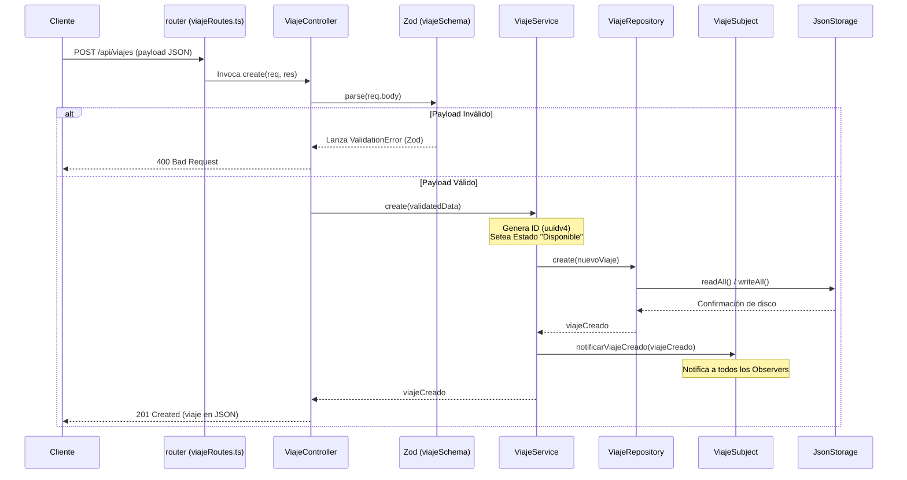

# 🛠️ Manual de Construcción e Implementación Arquitectónica — TransControl

Este documento detalla la estructura física del proyecto, cómo fluyen los datos a través del código y los pasos concretos que un desarrollador debe seguir para implementar nuevas funcionalidades en **TransControl**.

---

## 1. Estructura Física de Directorios (Mapeo de Código)

A continuación se detalla dónde reside cada componente del backend:

```
backend/
├── src/
│   ├── app.ts                  # Punto de entrada. Inicializa Express y monta rutas.
│   ├── domain/                 # CAPA DE DOMINIO
│   │   ├── entities/           # Definición de tipos y entidades puras (Usuario.ts, Viaje.ts)
│   │   ├── interfaces/         # Interfaces/Contratos abstractos (ITransportistaRepository.ts)
│   │   └── observer/           # Clases base e interfaces de eventos (SystemObserver.ts)
│   ├── business/               # CAPA DE NEGOCIO (LOGICA)
│   │   ├── services/           # Servicios principales coordinadores (ViajeService.ts)
│   │   ├── strategies/         # Estrategias cambiables (route_strategy.ts, NotificationStrategies.ts)
│   │   └── validators/         # Validadores de entrada con Zod (Schemas.ts)
│   ├── data/                   # CAPA DE DATOS (INFRAESTRUCTURA)
│   │   ├── storage/            # Clase genérica de lectura/escritura física (JsonStorage.ts)
│   │   ├── adapters/           # Adaptadores que implementan las interfaces (JsonViajeAdapter.ts)
│   │   ├── repositories/       # Singletons de repositorio exportados (ViajeRepository.ts)
│   │   └── datasource/         # Archivos .json que sirven de base de datos simulada
│   └── presentation/           # CAPA DE PRESENTACION
│       ├── controllers/        # Controladores Express (ViajeController.ts)
│       └── routes/             # Enrutadores Express donde se realiza la inyección (viajeRoutes.ts)
```

---

## 2. Ciclo de Vida de una Petición (Request Lifecycle)

Cuando un cliente frontend envía una petición para registrar un viaje, el flujo físico que sigue el código es el siguiente:



---

## 3. Ensamblado e Inyección de Dependencias (DI) en el Código

El backend no utiliza frameworks pesados como NestJS para la inyección de dependencias. Se utiliza **DI manual** en la capa de Rutas para maximizar la simplicidad y la testabilidad.

Ejemplo de `backend/src/presentation/routes/transportistaRoutes.ts`:

```typescript
import { Router } from 'express';
import { TransportistaController } from '../controllers/TransportistaController';
import { TransportistaService } from '../../business/services/TransportistaService';
import { TransportistaRepository } from '../../data/repositories/TransportistaRepository';

const router = Router();

// 1. Instanciamos el servicio pasándole el repositorio correspondiente
const transportistaService = new TransportistaService(TransportistaRepository);

// 2. Instanciamos el controlador pasándole el servicio
const transportistaController = new TransportistaController(transportistaService);

// 3. Asociamos las rutas HTTP a los métodos del controlador
router.post('/', transportistaController.create);
router.get('/', transportistaController.getAll);

export default router;
```

---

## 4. Guía Práctica: Cómo agregar un nuevo módulo ("Vehículo")

Para extender la aplicación agregando un nuevo módulo (por ejemplo, gestión de **Vehículos**), se deben seguir estos pasos de construcción ordenadamente:

### Paso 1: Definir la Entidad de Dominio
Crear `backend/src/domain/entities/Vehiculo.ts`:
```typescript
export interface Vehiculo {
  id: string;
  placa: string;
  marca: string;
  modelo: string;
  capacidadCarga: number; // en toneladas
}
```

### Paso 2: Definir la Interfaz de Repositorio
Crear `backend/src/domain/interfaces/IVehiculoRepository.ts`:
```typescript
import { Vehiculo } from '../entities/Vehiculo';

export interface IVehiculoRepository {
  create(vehiculo: Vehiculo): Promise<Vehiculo>;
  findAll(): Promise<Vehiculo[]>;
  findById(id: string): Promise<Vehiculo | null>;
}
```

### Paso 3: Crear el Adaptador de Datos
Crear `backend/src/data/adapters/JsonVehiculoAdapter.ts`:
```typescript
import { Vehiculo } from '../../domain/entities/Vehiculo';
import { IVehiculoRepository } from '../../domain/interfaces/IVehiculoRepository';
import { JsonStorage } from '../storage/JsonStorage';

export class JsonVehiculoAdapter implements IVehiculoRepository {
  private storage = new JsonStorage<Vehiculo>('vehiculos.json');

  async create(vehiculo: Vehiculo): Promise<Vehiculo> {
    const data = await this.storage.readAll();
    data.push(vehiculo);
    await this.storage.writeAll(data);
    return vehiculo;
  }

  async findAll(): Promise<Vehiculo[]> {
    return await this.storage.readAll();
  }

  async findById(id: string): Promise<Vehiculo | null> {
    const data = await this.storage.readAll();
    return data.find(v => v.id === id) || null;
  }
}
```

### Paso 4: Crear la Instancia del Repositorio
Crear `backend/src/data/repositories/VehiculoRepository.ts`:
```typescript
import { JsonVehiculoAdapter } from '../adapters/JsonVehiculoAdapter';

export const VehiculoRepository = new JsonVehiculoAdapter();
```

### Paso 5: Crear el Servicio de Negocio
Crear `backend/src/business/services/VehiculoService.ts`:
```typescript
import { Vehiculo } from '../../domain/entities/Vehiculo';
import { IVehiculoRepository } from '../../domain/interfaces/IVehiculoRepository';
import { v4 as uuidv4 } from 'uuid';

export class VehiculoService {
  constructor(private vehiculoRepository: IVehiculoRepository) {}

  async registrarVehiculo(data: Omit<Vehiculo, 'id'>): Promise<Vehiculo> {
    const nuevo: Vehiculo = {
      ...data,
      id: uuidv4(),
    };
    return await this.vehiculoRepository.create(nuevo);
  }

  async listarVehiculos(): Promise<Vehiculo[]> {
    return await this.vehiculoRepository.findAll();
  }
}
```

### Paso 6: Crear el Controlador y las Rutas de Presentación
Crear `backend/src/presentation/controllers/VehiculoController.ts` y montar sus respectivas rutas en `backend/src/presentation/routes/vehiculoRoutes.ts` inyectando `VehiculoRepository` -> `VehiculoService` -> `VehiculoController`.

Finalmente, registrar las nuevas rutas en `backend/src/app.ts`:
```typescript
import vehiculoRoutes from './presentation/routes/vehiculoRoutes';
app.use('/api/vehiculos', vehiculoRoutes);
```
Con esto, la construcción del nuevo módulo queda perfectamente alineada a la arquitectura establecida.
