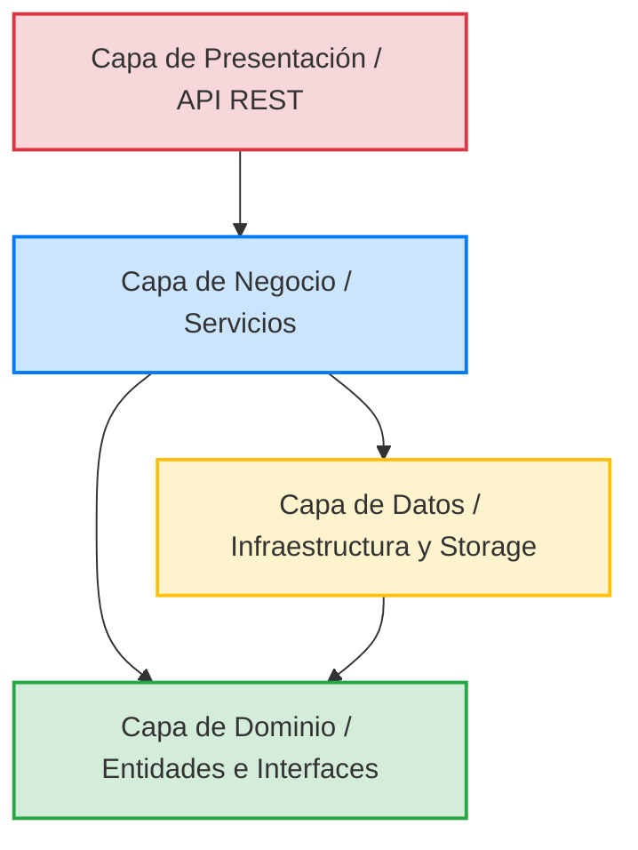

# 🏗️ Especificación de Diseño Arquitectónico — TransControl

Este documento describe la arquitectura de software de **TransControl** desde una perspectiva conceptual y de diseño. Se detallan los patrones arquitectónicos, la separación de responsabilidades y las decisiones de diseño que guían el desarrollo de la aplicación.

---

## 1. Estilo Arquitectónico: Arquitectura Limpia y de Tres Capas

**TransControl** adopta una combinación del patrón de **Arquitectura de Tres Capas** clásica adaptado con principios de **Arquitectura Limpia (Clean Architecture)** y **Diseño Guiado por el Dominio (DDD)**. 

La principal regla de diseño es la **Regla de Dependencia**: *Las capas externas pueden depender de las capas internas, pero las capas internas nunca deben depender ni saber nada de las capas externas.* El núcleo del sistema (el Dominio) es completamente agnóstico a las bases de datos, frameworks de red, protocolos de comunicación o interfaces de usuario.

### 1.1. Capa de Dominio (Domain)
Ubicada en `backend/src/domain/`. Representa el núcleo del negocio. Contiene:
- **Entidades de Dominio:** Modelos que representan los conceptos del negocio (e.g., `Viaje`, `Transportista`, `Usuario`).
- **Interfaces de Repositorio:** Contratos abstractos que definen qué operaciones de persistencia necesita el negocio, sin detallar el "cómo" (e.g., `ITransportistaRepository`).
- **Modelos de Eventos / Contratos Transversales:** Abstracciones como `ISystemObserver` para implementar desacoplamiento de eventos.

### 1.2. Capa de Negocio / Aplicación (Business)
Ubicada en `backend/src/business/`. Implementa las reglas de negocio y los casos de uso específicos del sistema. Contiene:
- **Servicios (`Services`):** Clases que coordinan los flujos de trabajo (e.g., crear un viaje, asignar un transportista, validar reglas de negocio).
- **Estrategias (`Strategies`):** Algoritmos de negocio que pueden variar dinámicamente (e.g., el cálculo de rutas más cortas, seguras o rápidas).
- **Validadores:** Esquemas de verificación de datos (e.g., usando Zod) para asegurar que la entrada cumple con los requisitos del negocio.

### 1.3. Capa de Datos / Infraestructura (Data)
Ubicada en `backend/src/data/`. Provee mecanismos técnicos de persistencia y comunicación externa. Contiene:
- **Adaptadores (`Adapters`):** Clases concretas que adaptan APIs de bajo nivel (e.g., lectura/escritura de archivos JSON) a los contratos del Dominio (e.g., `JsonTransportistaAdapter` implementa `ITransportistaRepository`).
- **Almacenamiento (`Storage`):** La implementación real de bajo nivel que interactúa con el hardware o librerías externas (e.g., `JsonStorage` que maneja el módulo `fs/promises` de Node.js).

### 1.4. Capa de Presentación (Presentation)
Ubicada en `backend/src/presentation/`. Es la frontera externa del servidor. Contiene:
- **Controladores (`Controllers`):** Encargados de interceptar peticiones del cliente, mapear los payloads HTTP, invocar los servicios de negocio y enviar respuestas HTTP adecuadas.
- **Rutas (`Routes`):** Mapeo de endpoints URI de Express hacia los métodos de los controladores.

---

## 2. Decisiones de Diseño Clave

### 2.1. Desacoplamiento de la Persistencia
La capa de negocio nunca interactúa directamente con la persistencia física (los archivos JSON). En su lugar, interactúa a través de interfaces de repositorio (`ITransportistaRepository`). Esto permite que el motor de almacenamiento cambie completamente en el futuro sin que se altere una sola línea de código en la capa de negocio.

### 2.2. Inyección de Dependencias (DI)
Los servicios no instancian sus repositorios. Los reciben en el constructor. El ensamblado físico de las dependencias se gestiona en la capa de Presentación (en los enrutadores), actuando esta como un ensamblador o *Composition Root* simple.

### 2.3. Gestión de Eventos Desacoplada (Observer)
Acciones como la creación o cancelación de un viaje conllevan efectos secundarios colaterales (notificaciones push, emails, logs de auditoría). Para evitar contaminar el servicio de viajes con lógica de envío de correos o auditoría física, se utiliza el patrón de diseño **Observer**. El servicio de viajes solo publica eventos, y diversos módulos (observadores) reaccionan de manera asíncrona e independiente.

---

## 3. Atributos de Calidad de la Arquitectura

| Atributo | Cómo lo logra TransControl |
|---|---|
| **Mantenibilidad** | La clara separación de capas evita el código espagueti. Modificar el frontend o el adaptador de almacenamiento no altera el core del negocio. |
| **Testabilidad** | Al usar inyección de dependencias e interfaces en lugar de clases concretas, es sumamente fácil escribir pruebas unitarias simulando (*mocking*) el almacenamiento de datos. |
| **Escalabilidad** | Permite agregar nuevos algoritmos de rutas o nuevos métodos de notificación extendiendo estrategias u observadores, sin modificar el flujo principal del software (Principio Abierto/Cerrado). |
| **Flexibilidad Tecnológica** | Si se decide migrar de archivos JSON locales a una base de datos relacional (como PostgreSQL) con un ORM (como Prisma), la capa de dominio y de negocio permanecen idénticas. Solo se implementa un nuevo adaptador de datos. |
