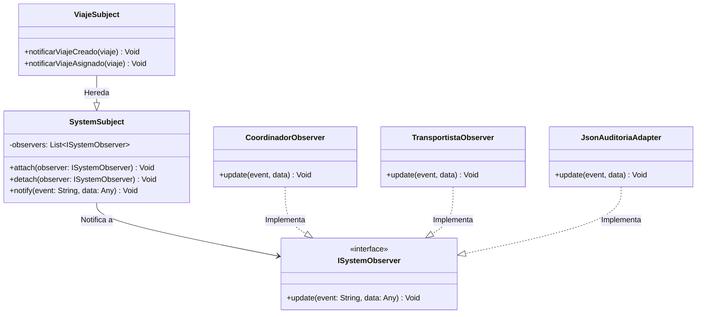
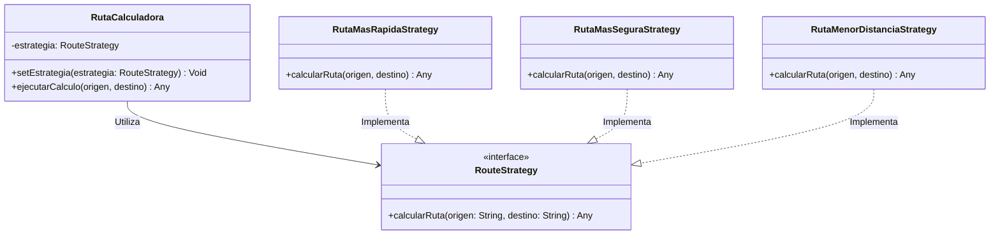
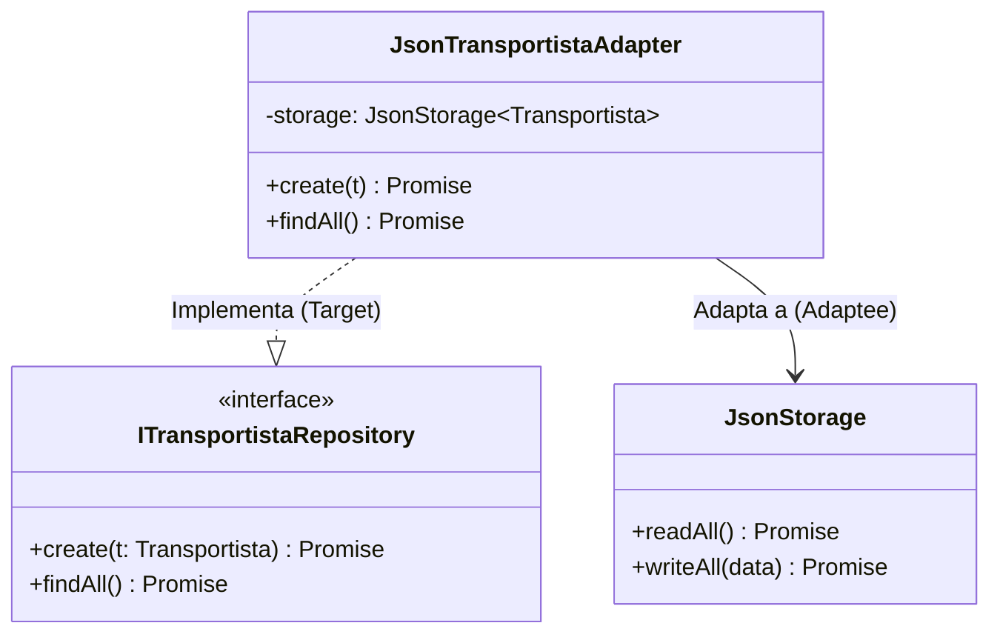

# 👁️ Catálogo de Diseño de Patrones de Software — TransControl

Este documento analiza conceptualmente los **Patrones de Diseño de Software** implementados en **TransControl**. Se explica el por qué de su elección, las responsabilidades de sus participantes y cómo promueven el bajo acoplamiento y la alta cohesión.

---

## 1. Patrón Observer (Comportamiento)

### 1.1. Propósito Conceptual
El patrón **Observer** define una dependencia de uno a muchos entre objetos, de manera que cuando un objeto cambia de estado (el *Sujeto*), todos sus dependientes (los *Observadores*) son notificados y actualizados de manera automática.

### 1.2. Razón de su uso en TransControl
Durante la creación o cambio de estado de un viaje, se deben disparar varias acciones secundarias:
- Notificar al Coordinador para que actualice su panel de control en tiempo real.
- Registrar una entrada de auditoría física (`auditoria.json`).
- Enviar notificaciones (Email, SMS o Push) al Transportista asignado y a la Secretaría.

Si programáramos todas estas acciones dentro del método `create` o `assign` del servicio de viajes, el código sería altamente acoplado y frágil. Si falla el servidor de correo o la escritura en disco, se interrumpiría la creación del viaje. Al usar el Observer, el servicio de viajes solo notifica al sujeto (`ViajeSubject`), y este se encarga de repartir los eventos pasivamente.

### 1.3. Diagrama de Clases (Conceptual)

---

## 2. Patrón Strategy (Comportamiento)

### 2.1. Propósito Conceptual
El patrón **Strategy** define una familia de algoritmos, encapsula cada uno de ellos y los hace intercambiables. Permite que el algoritmo varíe independientemente de los clientes que lo utilizan.

### 2.2. Razón de su uso en TransControl
1. **Cálculo de Rutas:** Dependiendo de las necesidades operativas (tiempo, costo, seguridad), el sistema debe calcular rutas usando diferentes criterios:
   - *Ruta Más Rápida:* Prioriza autopistas principales.
   - *Ruta Más Segura:* Prioriza vías vigiladas y destacamentos policiales.
   - *Ruta de Menor Distancia:* Prioriza carreteras cortas.
2. **Métodos de Notificación:** Las alertas pueden enviarse por distintos canales (Email, SMS, Notificaciones Push), cada uno con una implementación técnica diferente.

En lugar de tener bloques gigantescos de `if / else` en el controlador o servicio, encapsulamos cada algoritmo en su propia estrategia concreta. El controlador recibe la estrategia seleccionada y ejecuta el cálculo de forma genérica.

### 2.3. Diagrama de Clases (Conceptual)

---

## 3. Patrón Adapter (Estructural)

### 3.1. Propósito Conceptual
El patrón **Adapter** permite que clases con interfaces incompatibles trabajen juntas, traduciendo la interfaz de una clase (el *Adaptado*) en otra interfaz que los clientes esperan (el *Objetivo*).

### 3.2. Razón de su uso en TransControl
La lógica del backend necesita guardar y leer datos. Para evitar que las clases de servicio dependan de la manipulación de archivos físicos (módulo `fs` de Node.js), creamos una clase de utilidad genérica `JsonStorage`.
Sin embargo, los servicios de negocio no quieren invocar métodos genéricos como `readAll` y `writeAll` directamente; esperan trabajar con contratos de negocio estándar como `ITransportistaRepository` (el cual expone métodos como `create`, `update`, `delete`).

El **Adapter** (`JsonTransportistaAdapter`) actúa como puente: implementa la interfaz requerida por el dominio (`ITransportistaRepository`) y en su interior traduce estas llamadas para manipular el `JsonStorage`.

### 3.3. Diagrama de Clases (Conceptual)

---

## 4. Patrón Repository (Patrón de Arquitectura Empresarial)

### 4.1. Propósito Conceptual
El **Repository** actúa como una colección de objetos de dominio en memoria, mediando entre el dominio y las capas de mapeo de datos. Centraliza las consultas y la persistencia de datos.

### 4.2. Razón de su uso en TransControl
Garantiza que la lógica de negocio esté completamente desacoplada de la tecnología de persistencia. En TransControl, las clases `JsonViajeAdapter`, `JsonTransportistaAdapter` y `JsonUsuarioAdapter` implementan este patrón, permitiendo realizar consultas y escrituras transparentes sobre archivos JSON como si fuesen colecciones en memoria.
